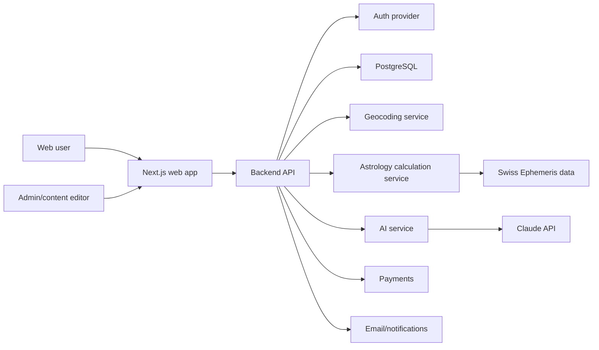
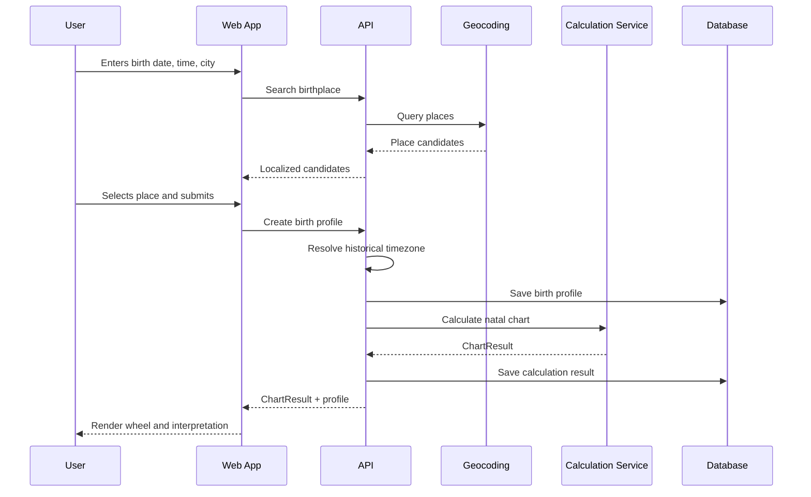
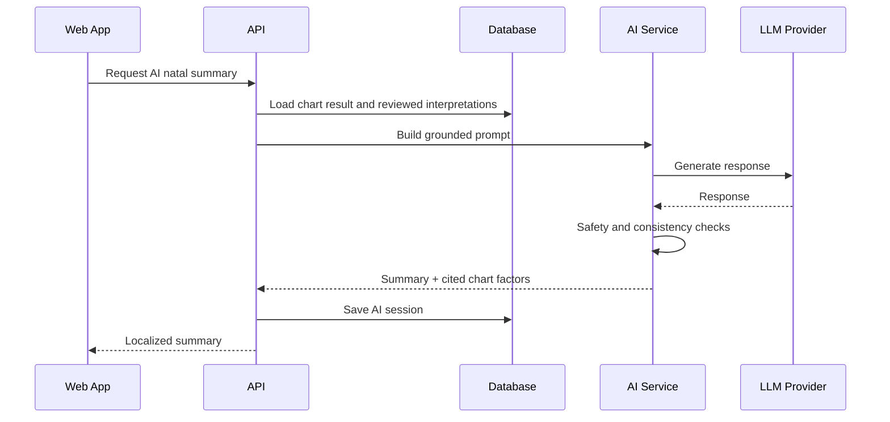

# Astroprocessor Architecture Plan

## Architecture Goals

- Calculation accuracy must be independently testable and versioned.
- The web app should stay fast and SEO-friendly.
- Sensitive birth data must be treated as personal data, not casual profile metadata.
- AI must be grounded in structured chart facts and reviewed interpretation content.
- Beginner UX and professional tools should share a calculation core but not the same interface complexity.

## Proposed Stack

| Layer | Choice | Notes |
|---|---|---|
| Frontend | Next.js + React + TypeScript | SEO, server rendering, app routes, PWA-ready |
| UI | shadcn/ui + Tailwind CSS | Local component primitives with accessible Radix foundations |
| UI State | Zustand | Lightweight local UI state |
| Server State | TanStack Query | API caching, retries, invalidation |
| API | Modular Fastify service | Chosen for the MVP scaffold because it keeps Docker/dev simple while preserving clear module boundaries |
| Calculation Engine | `sweph` Swiss Ephemeris binding | Kept behind `packages/astrology-core`; requires ephemeris files for high precision |
| Database | PostgreSQL | Users, profiles, charts, content, bookings, entitlements |
| ORM | Prisma or Drizzle | Choose based on team preference; Prisma is faster for MVP |
| Auth | Auth.js or managed provider | Must support OAuth/email and secure sessions |
| AI | Claude API behind internal AI service | Never call AI provider directly from frontend |
| Geocoding | Open-Meteo Geocoding for MVP | API-keyless provider behind a backend proxy; replaceable with Google/OpenCage later |
| Timezones | Historical timezone library plus provider validation | This is a critical accuracy dependency |
| Payments | Stripe first | Add local Ukrainian provider later if needed |
| Observability | Sentry + structured logs | Include calculation and AI error context with redaction |
| Hosting | Vercel for web, container service for API/ephemeris | Keep ephemeris runtime away from edge-only constraints |

## High-Level System



## Suggested Monorepo Layout

```text
apps/
  web/
    src/
      app/
      components/
      features/
      lib/
      styles/
  api/
    src/
      modules/
        auth/
        users/
        birth-profiles/
        charts/
        interpretations/
        ai/
        billing/
        consultations/
        crm/
      main.ts
packages/
  astrology-core/
    src/
      calculations/
      aspects/
      houses/
      zodiac/
      types/
      validation/
  chart-renderer/
    src/
      wheel/
      glyphs/
      layout/
  ui/
    src/
  config/
    eslint/
    typescript/
  i18n/
    src/
docs/
```

For the MVP, `astrology-core` can be used by the API only. The frontend should consume normalized API responses rather than recalculating charts client-side.

## Core Domain Model

### User

Represents an account owner.

Key fields:

- id
- email
- locale
- role
- createdAt
- updatedAt

### BirthProfile

Represents one person's birth data.

Key fields:

- id
- ownerUserId
- displayName
- birthDate
- birthTime
- birthTimeKnown
- birthplaceName
- countryCode
- latitude
- longitude
- timezone
- utcDateTime
- source
- visibility
- createdAt
- updatedAt

Security note: birth date, birth time, and exact place should be considered sensitive.

### ChartCalculation

Represents a calculated chart result and its engine metadata.

Key fields:

- id
- birthProfileId
- chartType
- zodiacType
- ayanamsa
- houseSystem
- calculationEngineVersion
- inputHash
- resultJson
- warningsJson
- calculatedAt

### Chart Result Payload

The calculation service should return a stable JSON contract:

```ts
type ChartResult = {
  chartType: "natal" | "transit" | "synastry" | "progression" | "return";
  settings: {
    zodiac: "tropical" | "sidereal";
    ayanamsa?: string;
    houseSystem: string;
  };
  subject: {
    utcDateTime: string;
    latitude: number;
    longitude: number;
  };
  angles: ChartPoint[];
  houses: HouseCusp[];
  bodies: ChartPoint[];
  aspects: Aspect[];
  warnings: CalculationWarning[];
};
```

### InterpretationItem

Represents reviewed human-written content.

Key fields:

- id
- locale
- interpretationType
- factorKey
- school
- title
- body
- readingLevel
- status
- version
- updatedAt

Example factor keys:

- `planet.sun.sign.aries`
- `planet.moon.house.4`
- `aspect.venus.trine.mars`

### AIConversation

Represents a chat or generated interpretation session.

Key fields:

- id
- userId
- birthProfileId
- chartCalculationId
- mode
- messages
- promptVersion
- safetyStatus
- createdAt

### ConsultationBooking

Represents paid or scheduled consultation flow.

Key fields:

- id
- clientUserId
- astrologerUserId
- serviceId
- status
- startsAt
- endsAt
- paymentStatus
- createdAt

## Main Data Flows

## Natal Chart Creation



## AI Interpretation Flow



## Backend Module Boundaries

### Auth Module

- Session validation.
- OAuth/email integration.
- Role checks.

### Birth Profiles Module

- CRUD for birth profiles.
- Place resolution.
- Timezone normalization.
- Visibility and sharing rules.

### Charts Module

- Calculation request orchestration.
- Result caching by input hash.
- House system and zodiac settings.
- Accuracy warnings.

### Astrology Core Package

- Swiss Ephemeris adapter.
- Zodiac conversion.
- House cusp calculation.
- Aspect calculation.
- Orb configuration.
- Midpoints and Arabic Parts later.

### Interpretations Module

- Match chart factors to content.
- Content versioning.
- Interpretation school support.
- Missing content reporting.

MVP status: the first seed-content preview is implemented in `packages/astrology-core` and exposed through `POST /interpretations/natal/preview`. It covers Sun sign, Moon sign, Ascendant sign, and the most exact major aspects as a controlled non-AI layer.

### AI Module

- Prompt construction.
- Context packing.
- Provider calls.
- Safety filters.
- AI audit logs.

### Education Module

- Lessons.
- Glossary.
- Tooltip content.
- SEO pages.

### Billing Module

- Products.
- Subscriptions.
- Entitlements.
- Webhooks.

### Consultations Module

- Astrologer services.
- Availability.
- Bookings.
- Payments.
- Calendar integrations.

### CRM Module

- Consultant client records.
- Notes.
- Shared chart access.
- Consultation history.

## Calculation Service Design

The calculation service should be isolated behind a stable internal API even if it initially lives in the same backend process.

Reasons:

- Swiss Ephemeris may need native dependencies or ephemeris files.
- Calculation correctness needs independent tests.
- Later professional techniques will grow quickly.
- It may need separate deployment from the frontend.

### Calculation API

Initial endpoints:

- `POST /charts/natal/calculate`
- `POST /charts/transit/calculate`
- `POST /charts/synastry/calculate`

Internal service methods:

- `calculateNatalChart(input, settings)`
- `calculateTransits(natalInput, transitDate, settings)`
- `calculateSynastry(subjectA, subjectB, settings)`
- `calculateAspects(points, orbProfile)`
- `calculateHouses(input, houseSystem)`

### Accuracy Testing

Use versioned fixtures:

```text
fixtures/
  reference-charts/
    astrodatabank/
    astro-com-manual/
    edge-cases/
```

Each fixture should include:

- input birth data;
- source;
- expected planetary positions;
- expected angles/houses where available;
- allowed tolerance;
- notes about timezone or source uncertainty.

## Frontend Architecture

Use feature-based organization rather than generic component folders only.

```text
features/
  birth-profile/
    components/
    hooks/
    api.ts
    types.ts
  chart/
    components/
    chart-wheel/
    placement-table/
    aspect-table/
    api.ts
  interpretations/
    components/
    glossary-tooltip/
    api.ts
  ai/
    components/
    api.ts
  dashboard/
```

### UI Principles

- Default mode is beginner-friendly.
- Advanced controls are visible through expert mode or expandable settings.
- Chart wheel and data tables should both be first-class views.
- Mobile must not force users to read a cramped chart wheel.
- Tooltips explain terms without sending users away from the chart.

## Database Areas

### MVP Tables

- users
- birth_profiles
- chart_calculations
- interpretation_items
- ai_sessions
- glossary_terms
- audit_events

### Phase 2 Tables

- friendships or chart_share_links
- transit_snapshots
- notification_preferences
- ai_conversations

### Phase 4 Tables

- products
- prices
- subscriptions
- entitlements
- astrologer_profiles
- consultation_services
- consultation_bookings
- consultant_clients
- consultant_notes

## Privacy And Security

### Sensitive Data

Treat these as sensitive:

- birth date;
- birth time;
- birthplace;
- exact coordinates;
- AI questions containing personal life details;
- consultant notes.

### Requirements

- Encrypt sensitive fields at rest where practical.
- Use role-based access for admin and consultant features.
- Redact sensitive data from logs.
- Store consent records for shared charts and consultant access.
- Implement data export and deletion.
- Avoid sending unnecessary personal data to AI providers.

## AI Guardrails

AI responses must:

- use structured chart facts from the backend;
- cite or list the factors used;
- avoid invented placements;
- avoid deterministic predictions;
- avoid medical, legal, financial, and crisis advice;
- separate astrology interpretation from factual claims;
- respect locale and tone.

Recommended internal AI context:

```text
1. User locale and reading level
2. Chart placements
3. Major aspects
4. House placements
5. Relevant reviewed interpretation snippets
6. User question
7. Safety and tone policy
```

## Deployment Shape

### MVP

- Web app on Vercel.
- API on container hosting.
- PostgreSQL managed database.
- Ephemeris files mounted or bundled with API service.
- Sentry for errors.

### Later

- Separate calculation service if CPU/native dependency profile requires it.
- Background worker for daily transit generation and email digests.
- CDN for public educational content.
- Admin app or admin section with strict role checks.

## Swiss Ephemeris Operations

The first adapter uses the `sweph` Node binding and reads ephemeris files from `SWISSEPH_EPHE_PATH`.

Minimum MVP files for modern natal charts:

- `sepl_18.se1` for planets;
- `semo_18.se1` for the Moon and nodes;
- `seas_18.se1` for Chiron and main asteroid-class bodies.

If these files are missing, calculations may fall back to lower-precision Moshier data and unavailable bodies are omitted with warnings. This is acceptable for development only, not for accuracy claims.

Licensing must be resolved before paid/commercial launch because Swiss Ephemeris and the Node binding carry license obligations.

## Technical Decisions To Make Before Coding

1. Monorepo tool: pnpm workspaces, Turborepo, or Nx.
2. API framework: NestJS vs Fastify/Express modules.
3. ORM: Prisma vs Drizzle.
4. Auth provider: Auth.js vs managed auth.
5. Geocoding provider: Google Places vs OpenCage.
6. Historical timezone strategy and fallback policy.
7. Swiss Ephemeris commercial licensing and production ephemeris-file distribution.
8. Content editing workflow: database admin, CMS, or Markdown-backed seed files.
9. AI provider abstraction shape.
10. Payment provider sequence: Stripe first or local provider first.

## MVP Architecture Recommendation

Start with:

- pnpm monorepo;
- `apps/web` with Next.js;
- `apps/api` with modular Fastify;
- `packages/astrology-core` for calculation types and pure logic;
- PostgreSQL + Prisma;
- Auth.js if it fits the deployment model, otherwise a managed provider;
- Swiss Ephemeris inside API first through `packages/astrology-core`, wrapped as if it were a separate service;
- interpretation content seeded from structured files into PostgreSQL;
- Claude API behind the backend only.

This keeps the first build focused while leaving room for professional modules, separate workers, and paid features later.
